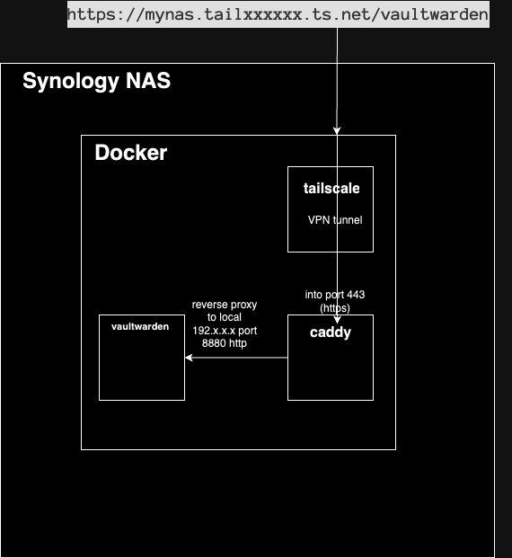
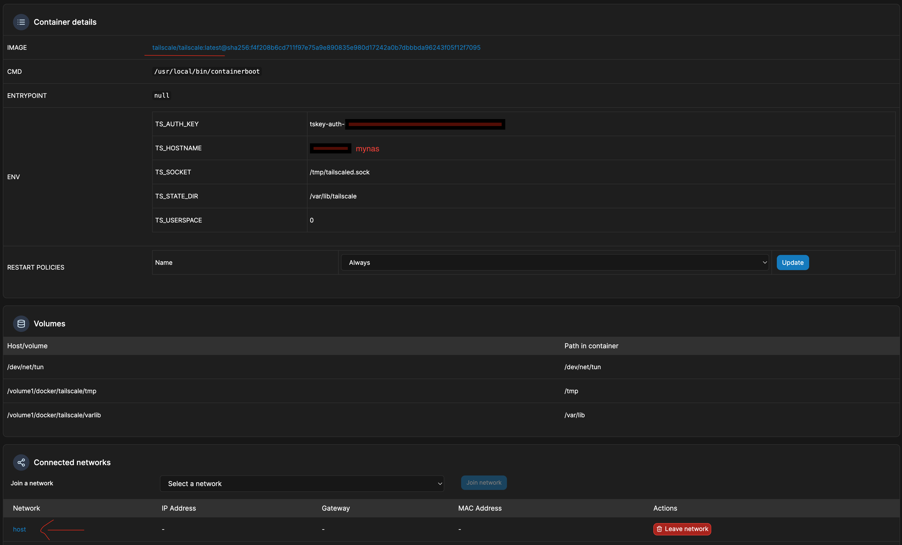
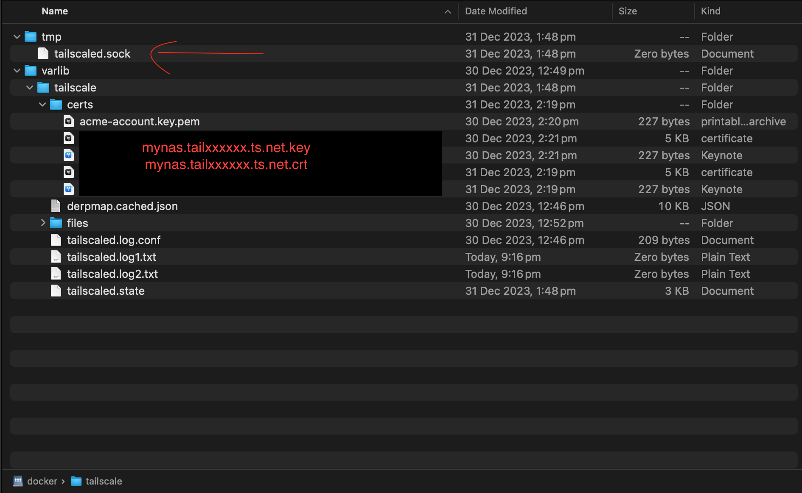
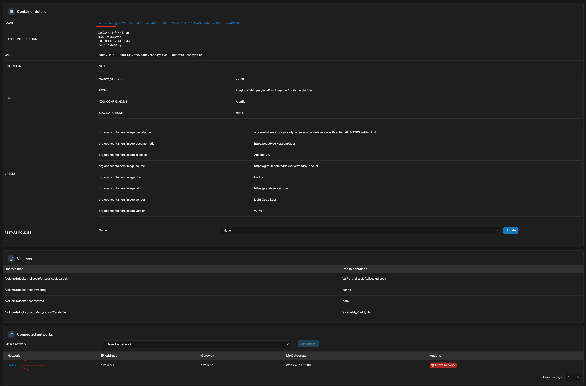
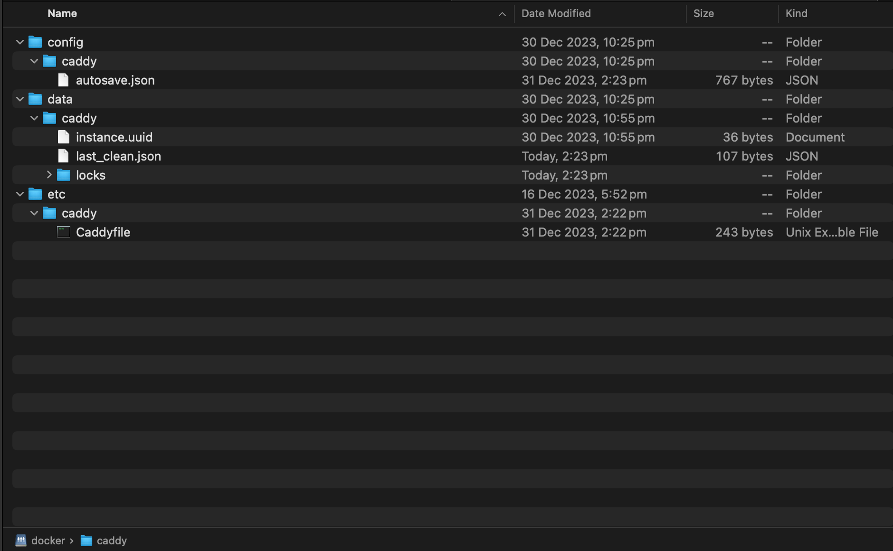

# Synology HTTPS docker tailscale caddy
Use Tailscale, a software defined network with Caddy as a reverse proxy to access Docker hosted services running on your Synology NAS over HTTPS. Tailscale makes it easy to securely connect to your Synology NAS devices over WireGuard.



# Motivation
Access bitwarden or any other docker hosted service on the Synology NAS using HTTPS and tailscale without opening up any ports in the NAS.  This will allow you to securely access these services via tailscale, without them being directly open to the internet.

# Prerequisites
### On the Synology NAS:
* ssh access to your Synology NAS

* Ports 80(http) and 443(HTTPS) needs  to be freed and remapped on the Synology NAS so that these ports can be used by Caddy to access the tailscale domain directly without specifying a port. (Eg use https://mynas.tailxxxxxx.ts.net/vaultwarden to access vaultwarden rather than using https://mynas.tailxxxxxx.ts.net:5443/vaultwarden).  Some services like Active Backup, Hybrid Share, Photo Station and Web Station use these ports. You will need to stop and uninstall these service packages in the NAS to prevent conflicts.  This step is a nice to have, can still specify a port in your tailscale url if you don't want to free up these ports.

* Portainer installed in synology.  This is needed because we need to create docker containers that can map .socket files as network volumes, bind volumes that are not mounted and expose port 443.  The built in Synology "Container Manager" won't let you do any of this.  Also the the log view in Portainer is far superior.

### In tailscale.com
* Create an account in tailscale.com. Enable HTTPS and MagicDNS under the DNS menu in tailscale.com

* Install tailscale in each of the devices that you plan to access the Synology hosted services from. (Eg, install tailscale on your mobile and laptop and these should be connected to tailscale successfully and showing up in the list of machines under the Machines menu of tailscale.com.)

# Steps
## Install portainer
You can follow a guide like this to [install docker and portainer](https://www.wundertech.net/how-to-install-portainer-on-a-synology-nas/)

## Free ports 80 and 443 on Synology
I followed this guide to [Free ports 80 and 443 on Synology NAS](https://gist.github.com/hjbotha/f64ef2e0cd1e8ba5ec526dcd6e937dd7?permalink_comment_id=4361097#gistcomment-4361097)
 * Remember to complete the section which makes the port changes permanent even after restarts of the Synology NAS.

## Create account in tailscale.com and register devices.
Create an account in [tailscale.com](tailscale.com). Also install and setup tailscale in your client devices like your mobile phone.

## Setup tailscale as docker container in Synology

Setup tailscale/tailscale:latest docker container using portainer. Name your container tailscaled.

1. Using the tailscale.com website, under Settings, keys, Generate auth key.  This is the value that is used by the TS_AUTH_KEY env variable.

1. Remember the TA_HOSTNAME env value as this is what you will use to access your hosted services.

1. The most important step here is the mapping of /volumes1/docker/tailscale/tmp into the /tmp directory of the docker container. This tmp directory will contain the .sock file that will be used by caddy to communicate with tailscale to retrieve the ssl certificates.  This mapping of /tmp allows us to expose the tailscaled.sock file into this directory.

1. Create the tailscale docker in the host network.  This is the same network where all of your other docker containers are running in.

1. Start the docker container. This will register your Synology NAS with tailscale.  You should be able to see your nas under Machines menu of tailscale.com account.

1. Now ssh into your Synology NAS. Generate certificates for your tailscale domain using the Synology terminal session. tailscaled is the container name.
  ```
  docker exec tailscaled tailscale --socket /tmp/tailscaled.sock cert <mynas.tailxxxxxx.ts.net>
  ``` 
1. In your NAS persistent storage volume for docker. You should see the zero byte tmp/tailscaled.sock file created.  The certificates to your domain (mynas.tailxxxxxx.ts.net.key and mynas.tailxxxxxx.ts.net.crt).  Do not continue to the next steps unless all these 2 things are there.


## Setup caddy as docker container in Synology.

1. get the caddy:latest docker image.
1. expose ports 443 as tcp and udp.
1. map the persistent volumes including the tailscale .sock file. 
1. Caddy should be in the bridge network.  This is a different network to all your other docker containers.
1. Create a Caddyfile in etc/caddy directory of the persistent storage of caddy using the ssh terminal session.
[CaddyFile](src/etc/caddy/Caddyfile)
1.  The caddy persistent storage directory should look like this.  Only the Caddyfile is manually created:


## Access your Synology NAS hosted vaultwarden service 
That is it, now you can access vaultwarden service hosted on your Synology NAS using:
https://mynas.tailxxxxxx.ts.net/vaultwarden from your laptop.  You will need to have the tailscale app installed and running in your laptop.

# Certificate Management
Caddy supports tailscale.  When Caddy gets an HTTPS request for a *.ts.net site, it gets the  certificate from the machine’s local Tailscale daemon. This is via the .socket file that is exposed from the tailscale docker container.  There’s no need to manually install any certificates to access *.ts.net sites from caddy. 

[Caddy  certificates](https://tailscale.com/kb/1190/caddy-certificates?q=TS_PERMIT_CERT_UID)


# References
[docker_tailscale_and_caddy_with__a_love_story](https://www.reddit.com/r/Tailscale/comments/104y6nq/docker_tailscale_and_caddy_with_https_a_love_story/)

[Free ports 80 and 443 on Synology NAS](https://gist.github.com/hjbotha/f64ef2e0cd1e8ba5ec526dcd6e937dd7?permalink_comment_id=4361097#gistcomment-4361097)

[What network ports are used by DSM services?](https://kb.synology.com/en-global/DSM/tutorial/What_network_ports_are_used_by_Synology_services)